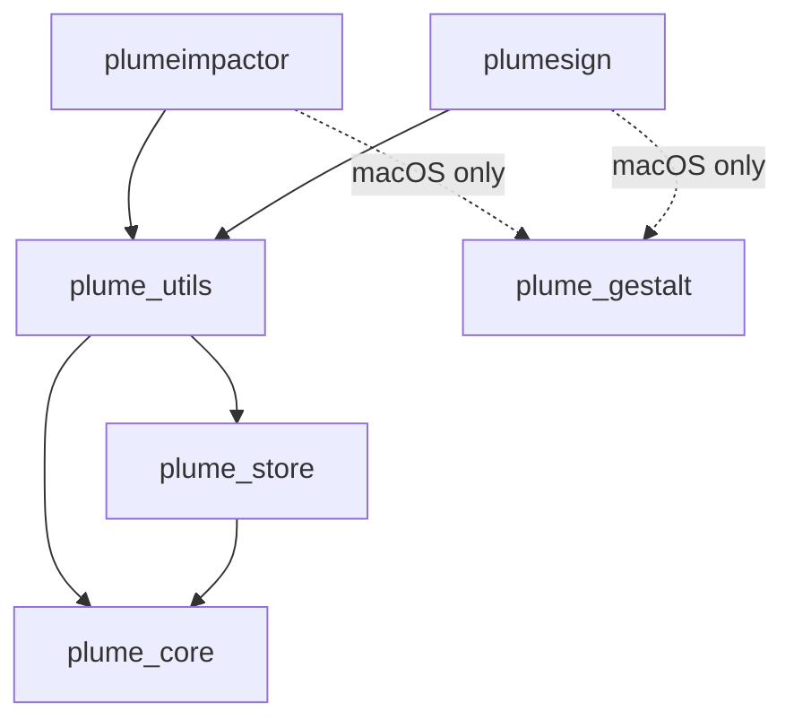

Impactor is organized as a Rust workspace with multiple modules, each serving specific purposes. Understanding this architecture is essential for contributing effectively.

## Workspace structure

The project uses Cargo workspace with Rust edition 2024:

```toml
[workspace]
resolver = "3"
members = [
    "apps/plumeimpactor",
    "apps/plumesign",
    "crates/plume_core",
    "crates/plume_gestalt", 
    "crates/plume_store",
    "crates/plume_utils",
]
```

## Applications

Impactor provides two frontend applications:

<CardGroup cols={2}>
  <Card title="plumeimpactor" icon="window">
    **GUI application**
    
    The main graphical interface built with [Iced](https://iced.rs/). Provides a user-friendly interface for sideloading apps with visual feedback.
    
    - Built with Iced for cross-platform GUI
    - System tray integration
    - File dialogs and notifications
    - Single instance enforcement
    - Auto-launch on startup support
  </Card>
  
  <Card title="plumesign" icon="terminal">
    **CLI application**
    
    Simple command-line interface for signing, using `clap` for argument parsing. Ideal for automation and scripting.
    
    - Command-line argument parsing with clap
    - Interactive prompts with dialoguer
    - Scriptable workflow support
  </Card>
</CardGroup>

## Core libraries

The functionality is split across four core crates:

### plume_core

**Apple API communication and authentication**

Handles all API requests for communicating with Apple developer services, along with providing auth for Apple's Grandslam.

<Accordion title="Key responsibilities">
  - **Apple Developer API**: Certificate management, provisioning profiles, device registration
  - **Grandslam authentication**: Apple ID authentication using Omnisette
  - **Cryptography**: AES, RSA, HMAC, SHA for secure communication
  - **Code signing**: Integration with apple-codesign-rs (forked and extended)
  - **Certificate handling**: P12, PEM, X.509 certificate management
  
  **License**: MPL-2.0 (Mozilla Public License 2.0)
</Accordion>

<Accordion title="Major dependencies">
  ```toml
  # Apple integration
  apple-codesign = { git = "PlumeImpactor/plume-apple-platform-rs" }
  omnisette = { git = "PlumeImpactor/omnisette" }
  
  # Cryptography
  aes-gcm = "0.11.0-rc.3"
  rsa = "0.9.8"
  pbkdf2 = "0.13.0-rc.9"
  
  # Certificates
  x509-certificate = "0.24.0"
  p12-keystore = "0.2.0"
  rcgen = "0.9.3"
  ```
</Accordion>

### plume_utils

**Signing and modification logic**

Shared code between GUI and CLI, containing signing and modification logic, and helper functions.

<Accordion title="Key responsibilities">
  - **IPA handling**: ZIP extraction and compression
  - **Binary modification**: App customization and tweak injection
  - **Signing workflow**: Coordinating the signing process
  - **Image processing**: Icon and asset handling
  - **Device communication**: Using idevice for installation
</Accordion>

<Accordion title="Major dependencies">
  ```toml
  idevice = { git = "PlumeImpactor/plume-idevice" }
  plume_core = { path = "../plume_core", features = ["tweaks"] }
  plume_store = { path = "../plume_store" }
  
  zip = "4.3"
  decompress = { git = "PlumeImpactor/decompress" }
  goblin = "0.9.3"  # Binary parsing
  ```
</Accordion>

### plume_store

**Data storage layer**

Handles persistent data storage for certificates, credentials, and application state.

<Accordion title="Key responsibilities">
  - **Certificate storage**: Local certificate and key management
  - **Configuration persistence**: User settings and preferences
  - **Cache management**: Temporary data and downloads
  - **Keychain integration**: Secure credential storage
</Accordion>

### plume_gestalt

**macOS UDID retrieval** (macOS only)

Wrapper for `libMobileGestalt.dylib`, used for obtaining your Mac's UDID for Apple Silicon sideloading.

<Accordion title="Platform support">
  This crate is only included on macOS builds:
  
  ```toml
  [target.'cfg(target_os = "macos")'.dependencies]
  plume_gestalt = { path = "../../crates/plume_gestalt" }
  ```
  
  It provides essential functionality for signing apps to run on Apple Silicon Macs.
</Accordion>

## Module dependency graph



## How Impactor works

Understanding the sideloading workflow helps when contributing:

<Steps>
  <Step title="Device registration">
    Register the iOS device to Apple's servers using the device's UDID.
  </Step>
  
  <Step title="Certificate creation">
    Create or reuse an Apple Developer certificate (lasts 365 days). The private key is stored locally in the keychain.
  </Step>
  
  <Step title="App registration">
    Register the app bundle identifier with Apple's servers.
  </Step>
  
  <Step title="Provisioning profile">
    Request a provisioning profile with entitlements gathered from the app binary.
  </Step>
  
  <Step title="Download credentials">
    Download the certificate and provisioning profile needed for signing.
  </Step>
  
  <Step title="App modification">
    Perform necessary modifications:
    - Inject tweaks (using ElleKit)
    - Change app name/bundle ID
    - Add frameworks, bundles, or app extensions
    - Handle entitlements
  </Step>
  
  <Step title="Code signing">
    Sign the app using apple-codesign-rs with the downloaded certificate.
  </Step>
  
  <Step title="Installation">
    Install the signed app using idevice communication library.
  </Step>
</Steps>

<Note>
Free Apple Developer accounts are limited to 7-day signatures and a limited number of app IDs and provisioning profiles.
</Note>

## Key technologies

### Frontend (plumeimpactor)

- **[Iced](https://iced.rs/)**: Cross-platform GUI framework
- **tray-icon**: System tray integration
- **rfd**: Native file dialogs
- **notify-rust**: Desktop notifications

### Backend (shared)

- **[idevice](https://github.com/jkcoxson/idevice)**: Communication with installd for sideloading
- **[apple-codesign-rs](https://github.com/indygreg/apple-platform-rs)**: Code signing (forked and extended)
- **Omnisette**: Apple authentication (Grandslam)
- **goblin**: Binary parsing for entitlement extraction

### Platform-specific

- **macOS**: objc2 for native API access, MobileGestalt for UDID
- **Linux**: gtk for system tray, usbmuxd for device communication
- **Windows**: winresource for app resources, iTunes drivers required

## Contributing to modules

When contributing, identify which module your changes affect:

- **Apple API changes** → `plume_core`
- **Signing/modification logic** → `plume_utils`
- **Storage/persistence** → `plume_store`
- **GUI features** → `apps/plumeimpactor`
- **CLI features** → `apps/plumesign`
- **macOS UDID** → `plume_gestalt`

Refer to the [Building guide](/contributing/building) for platform-specific build instructions.
